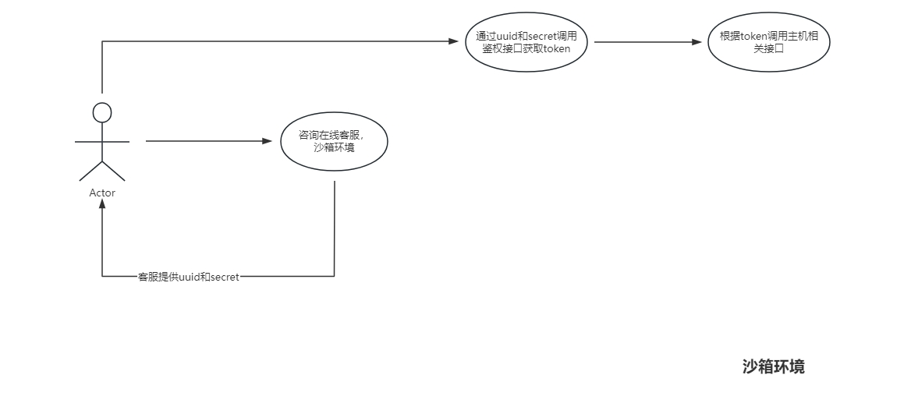
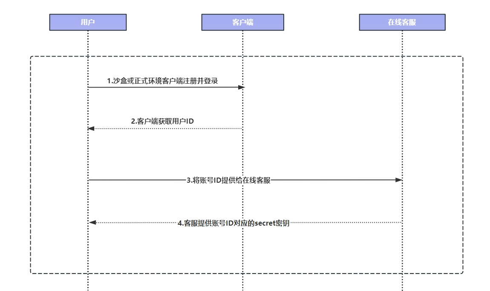

# 接入指南

### 相关环境的API请求网关
- **沙箱环境**：https://client-uat.xuandashi.com
- **生产环境**：https://client.xuandashi.com

### 环境选择
- **沙箱环境**
1. 简介：沙箱环境是渲大师开放平台为开发者提供的安全低门槛的测试环境，合理使用沙箱环境，可以让研发流程与商业流程并行，降低联调资损风险，加速项目的交付，同时不会对生产环境中的数据造成任何影响
2. 使用前提条件：开发者需要知晓自己的uuid和secret。获取详情见下方接入流程
- **生产环境**
1. 简介：生产环境是渲大师开放平台为开发者提供的安全稳定的生产环境，生产环境采用了多节点部署、负载均衡以及自适应扩容技术，以确保系统能够持续稳定运行。与沙箱环境配合使用，降低项目上线成本。
2. 使用前提条件：开发者需要知晓自己的uuid和secret。获取详情见下方接入流程

### 接入流程
渲大师主机租赁相关接口，接入流程如下:

- **沙箱环境**
1. 联系客服说明需要接入沙箱环境

2. 提供手机号或邮箱到客服，客服分配接口访问的uuid和secret(目前通过人工客服获取到相对的uuid和secret)

3. 通过获取的uuid和secret调用鉴权接口获取token

4. 根据上一步获取到的token去调用主机相关接口(注:调用部分主机接口需要保证钱余额充足)

5. 开发者需要注意在切换环境时需要使用正确的uuid和secret，沙箱环境使用的uuid和secret和生产环境使用的uuid和secret是不同的

​   流程图如下所示:

   
- **生产环境**
1. 在渲大师客户端注册渲大师账号（手机号、邮箱注册均可）
2. 获取接口访问的uuid和secret(目前通过注册账号提供到人工客服获取到相对的uuid和secret)
3. 通过获取的uuid和secret调用鉴权接口获取token
4. 根据上一步获取到的token去调用主机相关接口(注:调用部分主机接口需要保证钱余额充足)
5. 开发者需要注意在切换环境时需要使用正确的uuid和secret，沙箱环境使用的uuid和secret和生产环境使用的uuid和secret是不同的

​   流程图如下所示:

  

