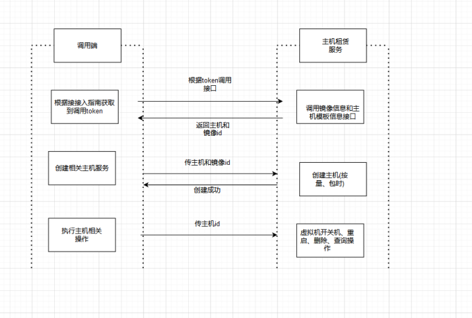

# 主机租赁接口

### 接口调用概述

​          调用前提:根据接入指南获取到相对应的token进行接口调用

​		  接入流程图参考:

​			

- 步骤一:根据接入指南完成账号配置获取到调用的token
- 步骤二:查询主机和镜像的信息获取到imageId和packageId
- 步骤三:根据上一步获取到的id去创建主机(分为按量和包时，需要保证钱包余额充足)
- 步骤四:创建主机后可调用主机相关接口，包括开关机、重启、删除、查询操作


#### 1. 镜像信息

**Path**

`GET`   `v1/pve/open/image`

**Request paramerter**

| Parameter           | Description | Required | Type   | Location |
| ------------------- | ----------- | -------- | ------ | -------- |
| Finovy-Access-Token | 令牌-口令   | yes      | string | header   |

**Response Type**:application/json

**Response Example**

```json
{
  "code":0,
  "data":[
       {
            "imageId": "4005",
            "type": "BL",
            "systemImageName": "Ubuntu Server",
            "systemImageVersion": "20.04 x64"
        }
  ],
  "msg":"success",
  "traceId":"xxxxxxxxxxxxxx"
}
```

| Responses Parameter | Description  | Type   |
| :------------------ | :----------- | ------ |
| imageId             | 镜像ID       | string |
| type                | 镜像类型     | string |
| systemImageName     | 镜像系统     | string |
| systemImageVersion  | 镜像系统版本 | string |

**Java Request sample**
```java
import java.io.IOException;
import java.io.InputStream;
import java.net.HttpURLConnection;
import java.net.URL;
import java.util.Scanner;
class Main{
    public static void main(String[] args) throws IOException {
        URL url = new URL("https://client.xuandashi.com/v1/pve/open/image");
        HttpURLConnection httpConn = (HttpURLConnection) url.openConnection();
        httpConn.setRequestMethod("GET");

        httpConn.setRequestProperty("Content-Type", "application/json");
        httpConn.setRequestProperty("Finovy-Access-Token", "3V41hUWEwlwKH44m7SpJOs");

        InputStream responseStream = httpConn.getResponseCode() / 100 == 2
                ? httpConn.getInputStream()
                : httpConn.getErrorStream();
        Scanner s = new Scanner(responseStream).useDelimiter("\\A");
        String response = s.hasNext() ? s.next() : "";
        System.out.println(response);
    }
}
```

#### 2. 主机模板信息

**Path**

`GET`   `v1/pve/open/packAge/{type}`

**Request paramerter**

| Parameter           | Description                | Required | Type   | Location |
| ------------------- | -------------------------- | -------- | ------ | -------- |
| Finovy-Access-Token | 令牌-口令                  | yes      | string | header   |
| type                | 模板类型（0按量、1包时段） | yes      | string | path     |

**Response Type**:application/json

**Response Example**

```json
{
    "code":0,
    "data":[
     {
            "packageId": "Wy1KiMqtPO",
            "name": "T使用---显卡*1",
            "gpuNumber": 1,
            "gpuName": null,
            "memoryNumber": 4,
            "rigidDiskNumber": 128,
            "amount": 1.10,
            "cpuNumber": 4,
            "bandWidth": 30,
            "type": "ceph",
            "pveMachineType": "1",
            "area": "0",
            "useType": "2",
            "discount": 1.00
        }
    ],
    "msg":"success",
    "traceId":"xxxxxxxxxxxxxx"
}
```

| Responses Parameter | Description                      | Type   |
|---------------------|----------------------------------| ------ |
| packageId           | 主机模板ID                           | string |
| name                | 主机模板名称                           | string |
| gpuNumber           | GPU数，为0则不支持使用显卡                  | int    |
| gpuName             | GPU名，为空则不支持使用显卡                  | string    |
| memoryNumber        | 内存数                              | int    |
| rigidDiskNumber   | 硬盘数                              | int    |
| cpuNumber           | cpu数                             | int    |
| band_width          | 带宽                               | int    |
| amount              | 金额(单价/小时)                        | string |
| discount            | 折扣，如1表示不打折，0.8表示打5折              | string |
| type                | 主机模板类型                           | string |
| pveMachineType      | 主机用途（0普通办公、1图像处理、2算法区域）          | string |
| area                | 数据中心（0华南、1华西、2国际）                | string |
| useType             | 主机使用类型（0仅支持按量、1仅支持包时段、2支持按量和包时段） | string |

**Java Request sample**
```java
import java.io.IOException;
import java.io.InputStream;
import java.net.HttpURLConnection;
import java.net.URL;
import java.util.Scanner;
class Main{
    public static void main(String[] args) throws IOException {
        URL url = new URL("https://client.xuandashi.com/v1/pve/open/packAge/0");
        HttpURLConnection httpConn = (HttpURLConnection) url.openConnection();
        httpConn.setRequestMethod("GET");

        httpConn.setRequestProperty("Content-Type", "application/json");
        httpConn.setRequestProperty("Finovy-Access-Token", "3V41hUWEwlwKH44m7SpJOs");

        InputStream responseStream = httpConn.getResponseCode() / 100 == 2
                ? httpConn.getInputStream()
                : httpConn.getErrorStream();
        Scanner s = new Scanner(responseStream).useDelimiter("\\A");
        String response = s.hasNext() ? s.next() : "";
        System.out.println(response);
    }
}
```


#### 3. 创建按量主机

**Path**

`POST`   `v1/pve/open/createquantity`

**Request paramerter**

| Parameter           | Description                                  | Required | Type   | Location |
| ------------------- | -------------------------------------------- | -------- | ------ | -------- |
| Finovy-Access-Token | 令牌-口令                                    | yes      | string | header   |
| packageId           | 主机模板ID（主机模板type需要和镜像type一致） | yes      | string | body     |
| imageId             | 镜像ID（镜像type需要和主机模板type一致）     | yes      | string | body     |

**Response Type**:application/json

**Response Example**

```json
{
    "code":0,
    "data":true,
    "msg":"success",
    "traceId":"xxxxxxxxxxxxxx"
}
```

**code**

| 错误码 | 错误描述                     | 解决方案              |
| ------ | ---------------------------- |-------------------|
| 1001   | 权限不足                     | 检查传入参数是否正确        |
| 7005   | 主机模板类型与镜像类型不一致 | 确认主机模板类型与镜像类型是否一致 |

**Java Request sample**
```java
import java.io.IOException;
import java.io.InputStream;
import java.net.HttpURLConnection;
import java.net.URL;
import java.util.Scanner;
class Main{
    public static void main(String[] args) throws IOException {
        URL url = new URL("https://client.xuandashi.com/v1/pve/open/createquantity");
        HttpURLConnection httpConn = (HttpURLConnection) url.openConnection();
        httpConn.setRequestMethod("POST");

        httpConn.setRequestProperty("Content-Type", "application/json");
        httpConn.setRequestProperty("Finovy-Access-Token", "3V41hUWEwlwKH44m7SpJOs");

        httpConn.setDoOutput(true);
        OutputStreamWriter writer = new OutputStreamWriter(httpConn.getOutputStream());
        writer.write("{\"packageId\": \"teTapaSUFq\", \"imageId\": \"507\" }");
        writer.flush();
        writer.close();
        httpConn.getOutputStream().close();

        InputStream responseStream = httpConn.getResponseCode() / 100 == 2
                ? httpConn.getInputStream()
                : httpConn.getErrorStream();
        Scanner s = new Scanner(responseStream).useDelimiter("\\A");
        String response = s.hasNext() ? s.next() : "";
        System.out.println(response);
    }
}
```

#### 4. 创建包时段主机

**Path**

`POST`   `v1/pve/open/createRent`

**Request paramerter**

| Parameter           | Description                                    | Required | Type   | Location |
| ------------------- |------------------------------------------------| -------- | ------ | -------- |
| Finovy-Access-Token | 令牌-口令                                          | yes      | string | header   |
| packageId           | 主机模板ID（主机模板type需要和镜像type一致）                    | yes      | string | body     |
| imageId             | 镜像ID（镜像type需要和主机模板type一致）                      | yes      | string | body     |
| periodNumber        | 购买周期（整数，如当periodNumber为1，periodType为1时，即周期为1天） | yes      | int    | body     |
| periodType          | 购买周期类型（0小时、1日、2周、3月、4季度、5年）                    | yes      | int    | body     |

**Response Type**:application/json

**Response Example**

```json
{
    "code":0,
    "data":"dyMFQQgHIW",
    "msg":"success",
    "traceId":"xxxxxxxxxxxxxx"
}
```

| Responses Parameter | Description | Type   |
| ------------------- | ----------- | ------ |
| data                | 主机ID      | string |

**code**

| 错误码 | 错误描述                     | 解决方案               |
| ------ | ---------------------------- |--------------------|
| 1001   | 权限不足                     | 请检查传入的参数是否正确       |
| 1037   | 未进行实名认证               | 请完成实名认证            |
| 6002   | 资源不足, 请重新选择配置     | 请选取其他主机模板          |
| 6005   | 创建等待                     | 请稍后重试              |
| 7005   | 主机模板类型与镜像类型不一致 | 请确认主机模板类型与镜像类型是否一致 |
| 9000   | 钱包异常                     | 钱包错误               |
| 9001   | 钱包余额不足                 | 余额不足               |

**Java Request sample**
```java
import java.io.IOException;
import java.io.InputStream;
import java.net.HttpURLConnection;
import java.net.URL;
import java.util.Scanner;
class Main{
    public static void main(String[] args) throws IOException {
        URL url = new URL("https://client.xuandashi.com/v1/pve/open/createRent");
        HttpURLConnection httpConn = (HttpURLConnection) url.openConnection();
        httpConn.setRequestMethod("POST");

        httpConn.setRequestProperty("Content-Type", "application/json");
        httpConn.setRequestProperty("Finovy-Access-Token", "3V41hUWEwlwKH44m7SpJOs");

        httpConn.setDoOutput(true);
        OutputStreamWriter writer = new OutputStreamWriter(httpConn.getOutputStream());
        writer.write("{\"packageId\": \"teTapaSUFq\", \"imageId\": \"507\", \"periodNumber\": 4, \"periodType\": 3 }");
        writer.flush();
        writer.close();
        httpConn.getOutputStream().close();

        InputStream responseStream = httpConn.getResponseCode() / 100 == 2
                ? httpConn.getInputStream()
                : httpConn.getErrorStream();
        Scanner s = new Scanner(responseStream).useDelimiter("\\A");
        String response = s.hasNext() ? s.next() : "";
        System.out.println(response);
    }
}
```

#### 5. 开机/关机

**Path**

`GET`   `v1/pve/open/operate/{id}`

**Request paramerter**

| Parameter           | Description                     | Required | Type   | Location |
| ------------------- | ------------------------------- | -------- | ------ | -------- |
| Finovy-Access-Token | 令牌-口令                       | yes      | string | header   |
| id                  | 主机ID                          | yes      | string | path     |
| type                | 0：关闭主机     1：开启主机 | yes      | string | query    |

**Response Type**:application/json

**Response Example**

```json
{
    "code":0,
    "data":true,
    "msg":"success",
    "traceId":"xxxxxxxxxxxxxx"
}
```

**code**

| 错误码 | 错误描述                 | 解决方案    |
| ------ | ------------------------ |---------|
| 1001   | 权限不足                 | 请检查传入的参数是否正确        |
| 6000   | 开机中                   | 请等待开机完成 |
| 6001   | 关机中                   | 请等待关机完成 |
| 6002   | 资源不足, 请重新选择配置 | 请选取其他主机模板        |
| 6003   | 钱包余额不足             | 余额一小时        |

**Java Request sample**
```java
import java.io.IOException;
import java.io.InputStream;
import java.net.HttpURLConnection;
import java.net.URL;
import java.util.Scanner;
class Main{
    public static void main(String[] args) throws IOException {
        URL url = new URL("https://client.xuandashi.com/v1/pve/open/operate/2dRVVRTTOJ?type=1");
        HttpURLConnection httpConn = (HttpURLConnection) url.openConnection();
        httpConn.setRequestMethod("GET");

        httpConn.setRequestProperty("Content-Type", "application/json");
        httpConn.setRequestProperty("Finovy-Access-Token", "3V41hUWEwlwKH44m7SpJOs");
        
        InputStream responseStream = httpConn.getResponseCode() / 100 == 2
                ? httpConn.getInputStream()
                : httpConn.getErrorStream();
        Scanner s = new Scanner(responseStream).useDelimiter("\\A");
        String response = s.hasNext() ? s.next() : "";
        System.out.println(response);
    }
}
```

#### 6. 重启

**Path**

`GET`   `v1/pve/open/reboot/{id}`

**Request paramerter**

| Parameter           | Description | Required | Type   | Location |
| ------------------- | ----------- | -------- | ------ | -------- |
| Finovy-Access-Token | 令牌-口令   | yes      | string | header   |
| id                  | 主机ID      | yes      | string | path     |

**Response Type**:application/json

**Response Example**

```json
{
    "code":0,
    "data":true,
    "msg":"success",
    "traceId":"xxxxxxxxxxxxxx"
}
```

**code**

| 错误码 | 错误描述               | 解决方案        |
| ------ | ---------------------- |-------------|
| 7002   | 未启动的主机不能重启   | 确保主机是已开机的状态 |
| 7003   | 主机不可用，不能重启 | 请稍后重试       |
| 7004   | 主机未运行，不能重启   | 确保主机是已开机的状态 |

**Java Request sample**
```java
import java.io.IOException;
import java.io.InputStream;
import java.net.HttpURLConnection;
import java.net.URL;
import java.util.Scanner;
class Main{
    public static void main(String[] args) throws IOException {
        URL url = new URL("https://client.xuandashi.com/v1/pve/open/reboot/2dRVVRTTOJ");
        HttpURLConnection httpConn = (HttpURLConnection) url.openConnection();
        httpConn.setRequestMethod("GET");

        httpConn.setRequestProperty("Content-Type", "application/json");
        httpConn.setRequestProperty("Finovy-Access-Token", "3V41hUWEwlwKH44m7SpJOs");
        
        InputStream responseStream = httpConn.getResponseCode() / 100 == 2
                ? httpConn.getInputStream()
                : httpConn.getErrorStream();
        Scanner s = new Scanner(responseStream).useDelimiter("\\A");
        String response = s.hasNext() ? s.next() : "";
        System.out.println(response);
    }
}
```

#### 7. 查询主机信息

**Path**

`GET`   `v1/pve/open/one/{id}`

**Request paramerter**

| Parameter           | Description | Required | Type   | Location |
| ------------------- | ----------- | -------- | ------ | -------- |
| Finovy-Access-Token | 令牌-口令   | yes      | string | header   |
| id                  | 主机ID      | yes      | string | path     |

**Response Type**:application/json

**Response Example**

```JSON
{
    "code":0,
    "data":{
        "id": "rEJjwEY5Wt",
        "name": "渲大师rEJjwEY5Wt",
        "gpuConfiguration": "-",
        "gpuNumber": null,
        "memory": 16,
        "cpu": 4,
        "rigidDisk": 128,
        "operatingSystem": "Windows",
        "hostAccount": "root",
        "hostPw": "EYAHeOJi",
        "useType": "0",
        "status": "0",
        "address": "gx-xds-rdp.songmao-idc.com",
        "port": 54220,
        "mac": null,
        "ipv4": null,
        "pveMachineType": "0",
        "createTime": 1692071029000,
        "expirationTime": null
    },
    "msg":"success",
    "traceId":"xxxxxxxxxxxxxx"
}
```

| Responses Parameter | Description                                       | Type   |
| :------------------ |:--------------------------------------------------| ------ |
| id                  | 主机ID                                              | string |
| name                | 主机名称                                              | string |
| gpuConfiguration    | GPU配置                                             | string |
| gpuNumber           | GPU数量                                             | int    |
| memory              | 内存数                                               | int    |
| cpu                 | cpu核数                                             | int    |
| rigidDisk           | 硬盘数                                               | int    |
| operatingSystem     | 操作系统（Windows,Windows Server,Ubuntu Server,Debian） | string |
| hostAccount         | 用户名（登录用户名）                                        | string |
| hostPw         | 密码                                                | string |
| address             | 主机连接地址                                            | string |
| port                | 主机连接端口                                            | int    |
| pveMachineType      | 主机使用范围，用途（0：普通办公、1：图像处理、2：算法区域）                   | string |
| createTime          | 主机创建时间                                            | long   |
| expirationTime      | 主机到期时间，有可能为空                                      | long   |
| mac                 | MAC地址                                             | string |
| ipv4                | ip地址                                              | string |
| useType             | 主机类型（0按量，1包时段）                                    | string |
| status              | 主机状态（0已关机 1关机中 2已开机 3扣费中 4关机中 5已过期）               | string |

**Java Request sample**
```java
import java.io.IOException;
import java.io.InputStream;
import java.net.HttpURLConnection;
import java.net.URL;
import java.util.Scanner;
class Main{
    public static void main(String[] args) throws IOException {
        URL url = new URL("https://client.xuandashi.com/v1/pve/open/one/2dRVVRTTOJ");
        HttpURLConnection httpConn = (HttpURLConnection) url.openConnection();
        httpConn.setRequestMethod("GET");

        httpConn.setRequestProperty("Content-Type", "application/json");
        httpConn.setRequestProperty("Finovy-Access-Token", "3V41hUWEwlwKH44m7SpJOs");
        
        InputStream responseStream = httpConn.getResponseCode() / 100 == 2
                ? httpConn.getInputStream()
                : httpConn.getErrorStream();
        Scanner s = new Scanner(responseStream).useDelimiter("\\A");
        String response = s.hasNext() ? s.next() : "";
        System.out.println(response);
    }
}
```

#### 8. 批量查询主机信息

**Path**

`GET`   `v1/pve/open/mypage`

**Request paramerter**

| Parameter           | Description                    | Required | Type    | Location |
| ------------------- | ------------------------------ | -------- | ------- | -------- |
| Finovy-Access-Token | 令牌-口令                      | yes      | string  | header   |
| page                | 起始页                         | yes      | integer | query    |
| pageSize            | 页大小，单次最多只支持查询25条 | yes      | integer | query    |

**Response Type**:application/json

**Response Example**

```json
{
    "code":0,
    "data":{"data":
    [
        {
                "id": "OWWWuy7Gcj",
                "name": "渲大师OWWWuy7Gcj",
                "gpuConfiguration": "-",
                "gpuNumber": null,
                "memory": 8,
                "cpu": 2,
                "rigidDisk": 80,
                "operatingSystem": "Windows",
                "hostAccount": "root",
                "hostPw": "cWf4psCY",
                "useType": "1",
                "status": "0",
                "address": "",
                "port": 0,
                "pveMachineType": "0",
                "createTime": 1692350230000,
                "expirationTime": 1692436630000
            },
            {
                "id": "arpFxoBgGp",
                "name": "渲大师arpFxoBgGp",
                "gpuConfiguration": "-",
                "gpuNumber": null,
                "memory": 8,
                "cpu": 2,
                "rigidDisk": 500,
                "operatingSystem": "Windows",
                "hostAccount": null,
                "hostPw": null,
                "useType": "0",
                "status": "0",
                "address": null,
                "port": null,
                "pveMachineType": "0",
                "createTime": 1692350025000,
                "expirationTime": null
            }
    ],
    "totalCounts":2
 },
    "msg":"success",
    "traceId":"xxxxxxxxxxxxxx"
}
```

| Responses Parameter     | Description                                       | Type   |
|:------------------------|:--------------------------------------------------| ------ |
| id                      | 主机ID                                              | string |
| name                    | 主机名称                                              | string |
| gpuConfiguration        | GPU配置                                             | string |
| gpuNumber               | GPU数量                                             | int    |
| memory                  | 内存数                                               | int    |
| cpu                     | cpu核数                                             | int    |
| rigidDisk               | 硬盘数                                               | int    |
| operatingSystem         | 操作系统（Windows,Windows Server,Ubuntu Server,Debian） | string |
| hostAccount             | 用户名（登录用户名）                                        | string |
| address                 | 主机连接地址                                            | string |
| port                    | 主机连接端口                                            | int    |
| pveMachineType          | 主机使用范围，用途（0：普通办公、1：图像处理、2：算法区域）                   | string |
| createTime              | 主机创建时间                                            | long   |
| expirationTime          | 主机到期时间，有可能为空                                      | long   |
| useType                 | 主机类型（0按量，1包时段）                                    | string |
| status                  | 主机状态0已关机 1关机中 2已开机 3扣费中 4关机中 5已过期                 | string |
| totalCounts             | 主机总数                                              | string |

**Java Request sample**
```java
import java.io.IOException;
import java.io.InputStream;
import java.net.HttpURLConnection;
import java.net.URL;
import java.util.Scanner;
class Main{
    public static void main(String[] args) throws IOException {
        URL url = new URL("https://client.xuandashi.com/v1/pve/open/mypage?page=1&pageSize=10");
        HttpURLConnection httpConn = (HttpURLConnection) url.openConnection();
        httpConn.setRequestMethod("GET");

        httpConn.setRequestProperty("Content-Type", "application/json");
        httpConn.setRequestProperty("Finovy-Access-Token", "3V41hUWEwlwKH44m7SpJOs");
        
        InputStream responseStream = httpConn.getResponseCode() / 100 == 2
                ? httpConn.getInputStream()
                : httpConn.getErrorStream();
        Scanner s = new Scanner(responseStream).useDelimiter("\\A");
        String response = s.hasNext() ? s.next() : "";
        System.out.println(response);
    }
}
```

#### 9. 删除主机

**Path**

`DELETE`   `v1/pve/open/delete/{id}`

**Response Type**:application/json

**Request paramerter**

| Parameter           | Description | Required | Type   | Location |
| ------------------- | ----------- | -------- | ------ | -------- |
| Finovy-Access-Token | 令牌-口令   | yes      | string | header   |
| id                  | 主机ID      | yes      | string | path     |

**Response Example**

```json
{
    "code":0,
    "data":true,
    "msg":"success",
    "traceId":"xxxxxxxxxxxxxx"
}
```

**code**

| 错误码 | 错误描述 | 解决方案     |
| ------ | -------- |----------|
| 1001   | 权限不足 | 检查入参是否正确 |

**Java Request sample**
```java
import java.io.IOException;
import java.io.InputStream;
import java.net.HttpURLConnection;
import java.net.URL;
import java.util.Scanner;
class Main{
    public static void main(String[] args) throws IOException {
        URL url = new URL("https://client.xuandashi.com/v1/pve/open/delete/2dRVVRTTOJ");
        HttpURLConnection httpConn = (HttpURLConnection) url.openConnection();
        httpConn.setRequestMethod("DELETE");

        httpConn.setRequestProperty("Content-Type", "application/json");
        httpConn.setRequestProperty("Finovy-Access-Token", "3V41hUWEwlwKH44m7SpJOs");
        
        InputStream responseStream = httpConn.getResponseCode() / 100 == 2
                ? httpConn.getInputStream()
                : httpConn.getErrorStream();
        Scanner s = new Scanner(responseStream).useDelimiter("\\A");
        String response = s.hasNext() ? s.next() : "";
        System.out.println(response);
    }
}
```

#### 

#### 
