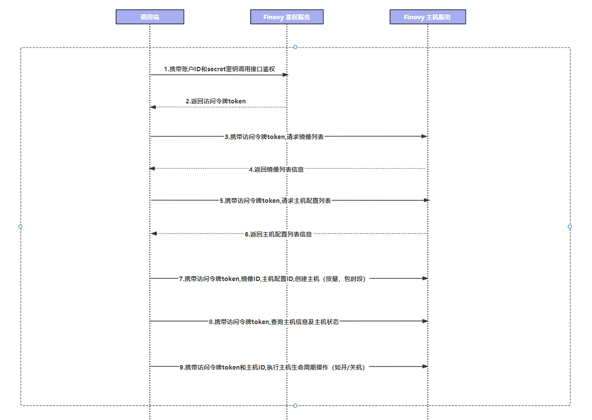

### 概述

​          调用前提:根据快速入门的指引，在接口鉴权中获取到相对应的token进行接口调用

​		  接入流程图参考:

​			

- 步骤一:根据快速入门的指引完成账号配置获取到调用的token
- 步骤二:查询主机和镜像的信息获取到imageId和packageId
- 步骤三:根据上一步获取到的id去创建主机(分为按量和包时，需要保证钱包余额充足和账号已完成实名认证)
- 步骤四:创建主机后可调用主机相关接口，包括开关机、重启、删除、查询操作