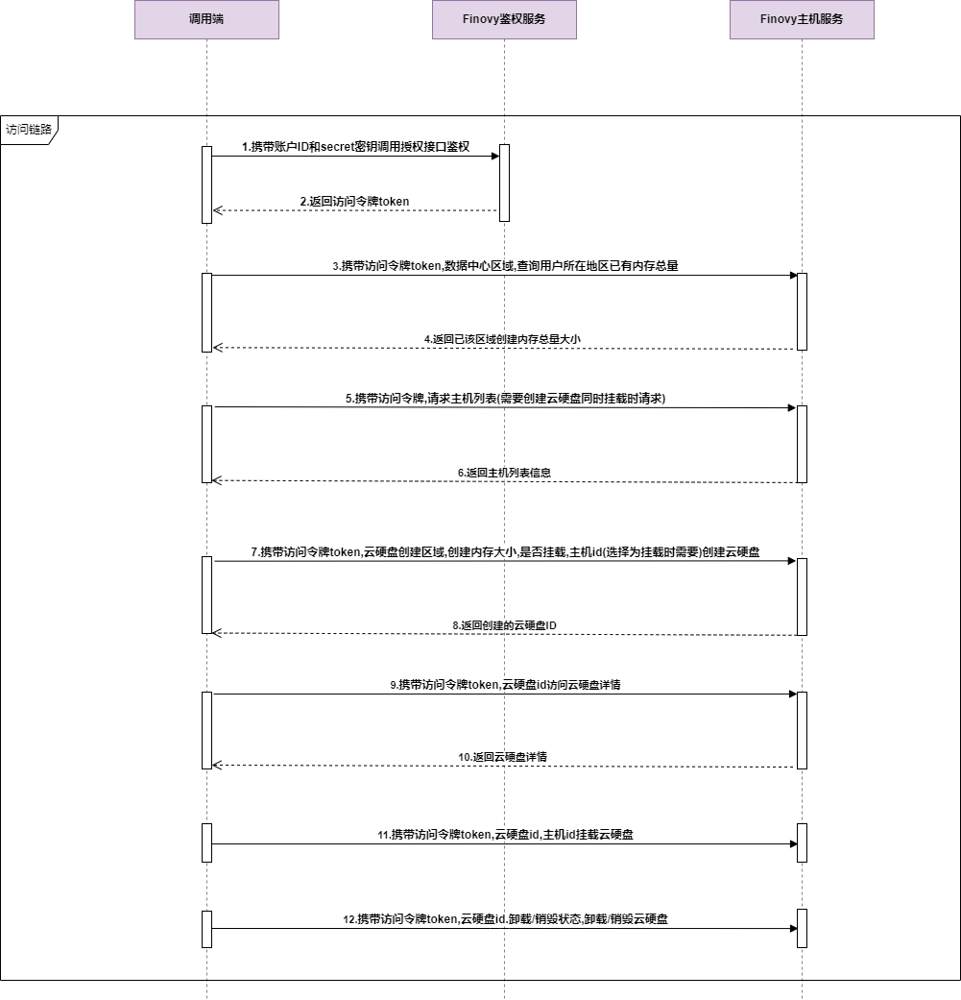

### 概述

​          调用前提:根据快速入门的指引，在接口鉴权中获取到相对应的token进行接口调用

​		  接入流程图参考:

​			

- 步骤一:携带账户ID和secret密钥调用授权接口鉴权
- 步骤二:携带访问令牌token,数据中心区域,查询用户所在地区已有内存总量
- 步骤三:携带访问令牌,请求主机列表(需要创建云硬盘同时挂载时请求)
- 步骤四:携带访问令牌token,云硬盘创建区域,创建内存大小,是否挂载,主机id(选择为挂载时需要)创建云硬盘
- 步骤五:携带访问令牌token,云硬盘id访问云硬盘详情
- 步骤六:携带访问令牌token,云硬盘id,主机id挂载云硬盘
- 步骤七:携带访问令牌token,云硬盘id.卸载/销毁状态,卸载/销毁云硬盘