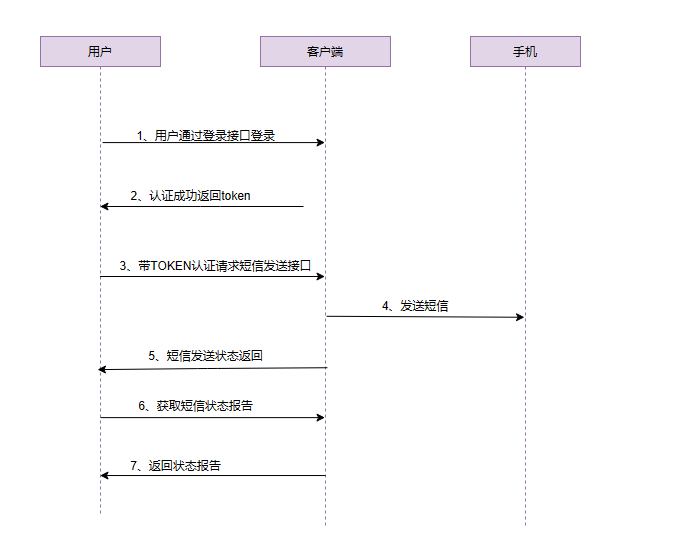

### 概述

调用前提:调用本服务登录接口，按照接口总览-1.登录，获取token

环境调用域名说明：

​		`沙盒环境` `smsapi-sandbox.finovy.cn`

​		`正式环境` `smsapi-formal.finovy.cn`

本接口提供短信服务，调用流程图如下：

​            

步骤一：通过登录接口获取token，调用短信服务接口，在请求头部加上认证参数。

步骤二：调用短信发送接口，发送短信。

步骤三：调用短信状态报告接口，获取短信发送状态报告。
